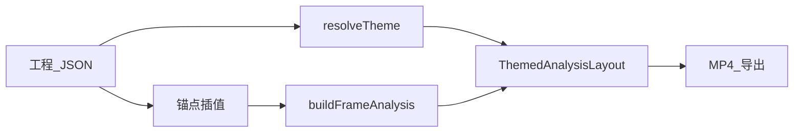

# Music Analysis Video — Wiki

本仓库用 **结构化工程 JSON** 描述乐理与分析信息，用 **Remotion** 渲染成片（竖屏 / 横屏）。本 Wiki 整理数据模型、时间同步、主题与开发命令。

## 目录

| 文档 | 内容 |
|------|------|
| [工程数据格式](project-data.md) | `project.json` 字段、与 TypeScript / JSON Schema 的对应关系 |
| [时间与同步](timing-and-sync.md) | 拍 ↔ 时间锚点、`beatToTime` / `timeToBeat`、成片时长 |
| [主题与画面](themes-and-layout.md) | 主题分层、`themeId`、版式组件职责 |
| [Remotion 与命令](remotion-workflow.md) | Studio、导出、入口文件、Composition |
| [目录结构](repository-layout.md) | 源码与资源路径速查 |
| [发布到 GitHub](github.md) | 初始化仓库、`git push`、可选 `gh repo create` |
| [Web 编辑器](editor.md) | `npm run editor:dev`、预览与 JSON 导入导出 |

## 一句话流程

更详细的说明见各子页。
